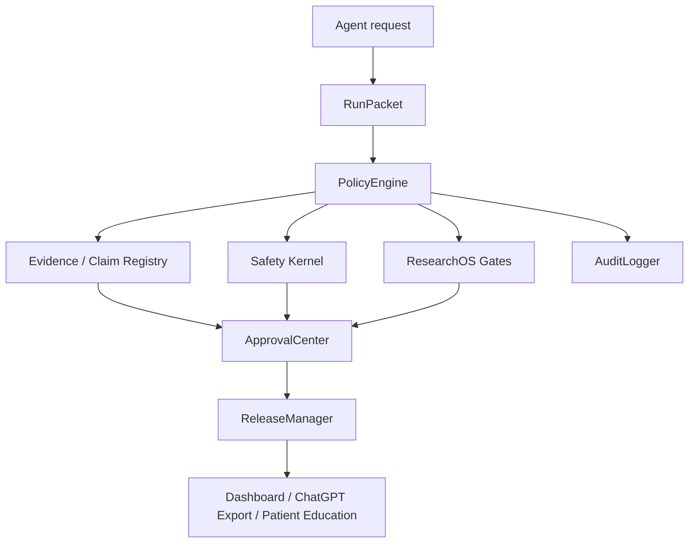

# Architecture

## Module map

- `app/core`: control plane.
- `app/evidence`: evidence and claim lifecycle.
- `app/safety`: safety kernel.
- `app/clinical_content`: clinical knowledge pack and draft runtime.
- `app/research_os`: research operating system.
- `app/export_bridge`: ChatGPT Project export.
- `app/patient_education`: patient education gate.
- `app/dashboard/v7_registry.py`: dashboard section contract.
