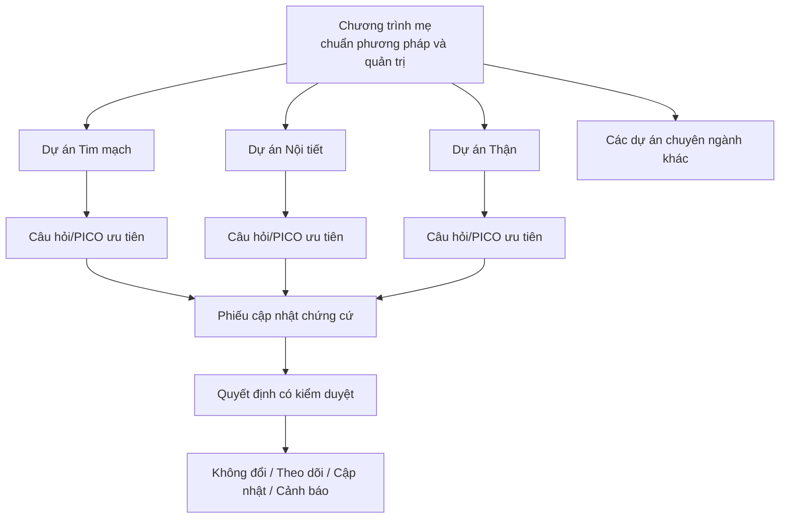
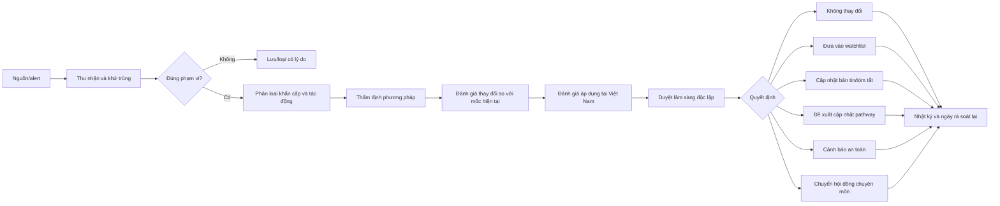

# CẨM NANG VẬN HÀNH CHƯƠNG TRÌNH CẬP NHẬT CHỨNG CỨ ĐA CHUYÊN NGÀNH

**Phiên bản:** 0.1 — bản khởi động 90 ngày  
**Ngày:** 25/08/2026  
**Tên làm việc:** Chương trình Cập nhật Chứng cứ Đa Chuyên ngành (sau đây gọi là “Chương trình”)

## 1. Quyết định thiết kế quan trọng nhất

Không tạo nhiều dự án độc lập với phương pháp khác nhau. Hãy tạo:

1. **Một Chương trình mẹ** quản lý chuẩn phương pháp, nguồn, biểu mẫu, chất lượng, danh mục và dashboard.
2. **Một dự án cho mỗi chuyên ngành** chịu trách nhiệm danh mục câu hỏi, sàng lọc tín hiệu và bản tin chuyên ngành.
3. **Một hồ sơ cho mỗi câu hỏi lâm sàng ưu tiên** theo PICO/PICOTS hoặc khung phù hợp.
4. **Một phiếu cập nhật cho mỗi tín hiệu chứng cứ** để theo dõi từ lúc phát hiện đến quyết định cuối.

Mô hình này giảm trùng lặp, giữ cùng một chuẩn và cho phép nhân rộng mà không phải thiết kế lại từ đầu.

## 2. Mục tiêu và ranh giới

### Mục tiêu

- Phát hiện sớm các chứng cứ có khả năng làm thay đổi thực hành.
- Duy trì danh mục câu hỏi lâm sàng ưu tiên luôn có ngày rà soát và trạng thái rõ ràng.
- Chuyển chứng cứ mới thành kết luận ngắn, minh bạch và có thể truy vết.
- Tách rõ “có chứng cứ mới” khỏi “cần thay đổi thực hành”.
- Ghi nhận đầy đủ quyết định, người duyệt, lý do và ngày đánh giá lại.
- Hiệu chỉnh khuyến nghị quốc tế theo bối cảnh Việt Nam: quy định Bộ Y tế, khả năng tiếp cận, chi phí, nguồn lực, mô hình bệnh tật và công bằng y tế.

### Không nằm trong phạm vi tự động

- Không tự động ban hành phác đồ hoặc thay đổi điều trị.
- Không dùng preprint, nội dung quảng bá, blog hoặc ý kiến đơn lẻ để đổi thực hành.
- Không gán GRADE hoặc độ mạnh khuyến cáo nếu chưa thực hiện đúng phương pháp và chưa có bác sĩ/phương pháp viên duyệt.
- Không xử lý dữ liệu có thông tin định danh người bệnh.
- Không thay thế hội đồng chuyên môn, dược lâm sàng hoặc quy trình phê duyệt của cơ sở.

## 3. Danh mục dự án đề xuất

Không nên khởi động tất cả cùng lúc. Dùng bảng chấm điểm trong workbook để chọn **2 dự án thí điểm**, sau đó mới mở rộng.

| Nhóm | Dự án chuyên ngành gợi ý | Nguồn lõi gợi ý |
|---|---|---|
| Nội khoa | Tim mạch | ESC, ACC/AHA, WHO, Bộ Y tế, PubMed |
| Nội khoa | Nội tiết – Đái tháo đường | ADA, EASD, WHO, Bộ Y tế, PubMed |
| Nội khoa | Thận | KDIGO, Bộ Y tế, PubMed |
| Nội khoa | Hô hấp | GOLD, GINA, WHO, Bộ Y tế, PubMed |
| Nội khoa | Tiêu hóa – Gan mật | AASLD, EASL, WHO, Bộ Y tế, PubMed |
| Nội khoa | Cơ xương khớp | EULAR, ACR, Bộ Y tế, PubMed |
| Nhiễm | Truyền nhiễm – Quản lý kháng sinh | WHO, IDSA, WHO AWaRe, Bộ Y tế, PubMed |
| Thần kinh – tâm thần | Thần kinh | AAN, ESO, WHO, Bộ Y tế, PubMed |
| Thần kinh – tâm thần | Tâm thần | WHO, NICE, APA, Bộ Y tế, PubMed |
| Ung thư | Ung bướu – Huyết học | WHO, ESMO, ASCO, Bộ Y tế, PubMed |
| Đối tượng đặc biệt | Nhi khoa | WHO, AAP, Bộ Y tế, PubMed |
| Đối tượng đặc biệt | Sản phụ khoa | WHO, FIGO, ACOG, Bộ Y tế, PubMed |
| Cấp tính | Cấp cứu – Hồi sức | WHO, SCCM, ERC/ILCOR, Bộ Y tế, PubMed |
| Xuyên suốt | An toàn thuốc | Cục Quản lý Dược, WHO, EMA, FDA, MHRA |
| Xuyên suốt | Thang điểm và công cụ lâm sàng | Bài gốc, nghiên cứu hiệu chỉnh, guideline nguồn |

**Lưu ý:** Danh sách là khung khởi tạo, không khẳng định mọi nguồn đều phù hợp với mọi câu hỏi. Mỗi dự án phải xác định lại nguồn chính thức, phạm vi và đối tượng.

## 4. Cách chọn hai dự án thí điểm

Chấm mỗi tiêu chí từ 1 đến 5; workbook tính điểm ưu tiên theo trọng số.

| Tiêu chí | Trọng số | Câu hỏi đánh giá |
|---|---:|---|
| Nguy cơ an toàn/nguy cơ gây hại | 25% | Nếu chậm cập nhật, hậu quả có thể nghiêm trọng đến đâu? |
| Gánh nặng bệnh và tần suất gặp | 20% | Chủ đề ảnh hưởng bao nhiêu lượt khám hoặc người bệnh? |
| Tốc độ thay đổi chứng cứ | 15% | Guideline, thuốc, thử nghiệm hoặc cảnh báo có thay đổi nhanh không? |
| Mức biến thiên thực hành | 15% | Có nhiều cách làm khác nhau hoặc nhiều điểm chưa thống nhất không? |
| Khả năng triển khai | 15% | Có trưởng nhóm, thời gian, dữ liệu và nguồn lực không? |
| Khả năng đo lường tác động | 10% | Có chỉ số quy trình/kết quả để theo dõi không? |

**Nguyên tắc chọn:** một dự án có tác động cao và một dự án dễ triển khai. Không nhất thiết chọn hai chuyên ngành có điểm tổng cao nhất nếu cùng phụ thuộc một nhóm nhân sự.

## 5. Danh mục câu hỏi trong mỗi chuyên ngành

Mỗi dự án thí điểm chỉ nên bắt đầu với **5–8 câu hỏi ưu tiên**, không phải toàn bộ chuyên ngành.

Mỗi câu hỏi phải có:

- Mã câu hỏi duy nhất.
- Câu hỏi theo PICO/PICOTS hoặc khung phù hợp với chẩn đoán, tiên lượng, tác hại hay triển khai.
- Dân số và bối cảnh áp dụng.
- Kết cục quan trọng, đặc biệt kết cục an toàn.
- Mốc chứng cứ hiện tại: guideline/bản tổng hợp đang được dùng, phiên bản, ngày truy cập.
- Ngày tìm kiếm gần nhất và ngày rà soát tiếp theo.
- Chủ sở hữu lâm sàng và người phụ trách phương pháp.
- Nhịp giám sát: liên tục, hàng tháng, hàng quý hoặc theo sự kiện.
- Trạng thái: đang thiết lập, hiện hành, cần rà soát, đang cập nhật, tạm dừng, đã đóng.

## 6. Thứ bậc nguồn và nguyên tắc giám sát

### Nhóm A — tín hiệu ưu tiên cao

- Cảnh báo an toàn, thu hồi, thay đổi nhãn hoặc chống chỉ định từ cơ quan quản lý.
- Guideline hoặc bản cập nhật chính thức từ Bộ Y tế, WHO và hội chuyên ngành phù hợp.
- Đính chính, biểu thức quan ngại hoặc rút bài liên quan đến chứng cứ nền.

### Nhóm B — bằng chứng có khả năng thay đổi thực hành

- Systematic review/meta-analysis chất lượng cao.
- RCT lớn, trực tiếp và có kết cục quan trọng cho người bệnh.
- Nghiên cứu chẩn đoán, tiên lượng hoặc an toàn có thiết kế mạnh và tác động rõ.

### Nhóm C — bằng chứng bổ sung

- Cohort lớn, nghiên cứu dữ liệu thực, nghiên cứu triển khai.
- Nghiên cứu hiệu chỉnh công cụ hoặc thang điểm trong quần thể phù hợp.

### Nhóm D — chỉ dùng như tín hiệu

- Preprint, abstract hội nghị, ý kiến chuyên gia, nội dung truyền thông, thông cáo hãng.
- Không dùng đơn độc để đổi thực hành; phải được gắn nhãn “chưa đủ để thay đổi”.

## 7. Quy trình chuẩn từ tín hiệu đến quyết định

### Các cổng chất lượng

1. **Cổng nguồn:** nguồn, phiên bản, ngày, PMID/DOI/URL được xác minh.
2. **Cổng phù hợp:** dân số, can thiệp/tiếp xúc, đối chứng và kết cục khớp câu hỏi.
3. **Cổng phương pháp:** nguy cơ sai lệch (risk of bias), độ trực tiếp, độ chính xác, tính nhất quán và thiên lệch công bố được xem xét.
4. **Cổng tác động:** nêu hiệu quả tuyệt đối khi có thể; không chỉ dựa vào p-value hoặc hiệu quả tương đối.
5. **Cổng an toàn:** tác hại, chống chỉ định, tương tác, liều và theo dõi không bị bỏ sót.
6. **Cổng bối cảnh:** khả năng tiếp cận, chi phí, nguồn lực, tính chấp nhận, công bằng và quy định Việt Nam.
7. **Cổng thẩm quyền:** ít nhất một bác sĩ chuyên ngành duyệt; thay đổi pathway/phác đồ phải theo quy trình phê duyệt của cơ sở.

## 8. Mức ưu tiên vận hành đề xuất

Đây là **SLA vận hành nội bộ đề xuất**, không phải khuyến cáo lâm sàng.

| Mức | Loại tín hiệu | Thời hạn phân loại | Đường xử lý |
|---|---|---:|---|
| P0 | Cảnh báo an toàn nghiêm trọng, thu hồi, chống chỉ định mới | Trong ngày làm việc | Chuyển ngay trưởng chuyên môn/dược lâm sàng; không chờ bản tin định kỳ |
| P1 | Guideline lớn hoặc nghiên cứu có khả năng đổi thực hành | ≤ 7 ngày | Thẩm định nhanh + duyệt chuyên gia |
| P2 | Bằng chứng quan trọng nhưng không khẩn | ≤ 30 ngày | Đưa vào kỳ cập nhật tháng |
| P3 | Tín hiệu sớm, gián tiếp hoặc chưa đủ chắc | Theo quý | Watchlist, chờ xác nhận |

## 9. Công cụ thẩm định theo loại tài liệu

| Loại tài liệu | Công cụ/chuẩn ưu tiên | Cách dùng trong Chương trình |
|---|---|---|
| Guideline | AGREE II; RIGHT để kiểm tra báo cáo | Chọn nguồn nền và đánh giá độ tin cậy/báo cáo |
| Systematic review | AMSTAR 2 và/hoặc ROBIS | Đánh giá phương pháp và nguy cơ sai lệch |
| RCT | RoB 2 | Đánh giá nguy cơ sai lệch theo kết cục |
| Nghiên cứu không ngẫu nhiên về can thiệp | ROBINS-I | Đánh giá sai lệch do nhiễu, chọn mẫu, phân loại can thiệp… |
| Chẩn đoán | QUADAS-2 | Đánh giá sai lệch và khả năng áp dụng |
| Mô hình dự đoán | PROBAST; TRIPOD/TRIPOD+AI để kiểm tra báo cáo | Phân biệt chất lượng mô hình và chất lượng báo cáo |
| Tổng hợp độ chắc chắn | GRADE | Đánh giá theo từng kết cục quan trọng |
| Từ chứng cứ đến quyết định | GRADE Evidence-to-Decision | Tách chứng cứ khỏi phán định và bối cảnh |
| Báo cáo quy trình tìm kiếm | PRISMA 2020; PRISMA-S | Bảo đảm truy vết cho tổng quan/cập nhật lớn |

Không cộng điểm cơ học để thay thế phán định. Người đánh giá phải lưu dẫn chứng cho từng nhận định quan trọng.

## 10. Phân loại quyết định cuối

Mỗi phiếu cập nhật phải kết thúc bằng đúng một trạng thái chính:

1. **NO CHANGE** — bằng chứng không làm thay đổi kết luận hiện tại.
2. **WATCH** — đáng chú ý nhưng chưa đủ chắc hoặc chưa đủ trực tiếp.
3. **CLARIFY** — cần sửa câu chữ, phạm vi hoặc cảnh báo nhưng không đổi ý định khuyến nghị.
4. **UPDATE SUMMARY** — cập nhật tóm tắt/bản tin, chưa đổi pathway.
5. **PROPOSE PRACTICE UPDATE** — đủ cơ sở để trình quy trình chuyên môn xem xét thay đổi.
6. **SAFETY ESCALATION** — cần chuyển khẩn đến người/cấp có thẩm quyền.
7. **RETIRE/SUPERSEDE** — tài liệu hoặc khuyến nghị cũ đã bị thay thế/rút bỏ.

Mọi trạng thái phải có: người quyết định, ngày, lý do, nguồn hỗ trợ và ngày đánh giá lại.

## 11. Sản phẩm đầu ra chuẩn

### A. Evidence Update Card — một trang

- Điều gì mới?
- So với mốc hiện tại, điều gì thực sự thay đổi?
- Đối tượng nào áp dụng/không áp dụng?
- Kết quả quan trọng: hiệu quả tuyệt đối, tương đối, độ chính xác và tác hại.
- Độ chắc chắn của chứng cứ; nguồn gốc mức đánh giá.
- Khả năng áp dụng tại Việt Nam.
- Quyết định và hành động tiếp theo.
- PMID/DOI/URL, phiên bản và ngày truy cập.

### B. Bản tin chuyên ngành hàng tháng

- Tối đa 3–5 nội dung đã ưu tiên.
- Mỗi nội dung có nhãn P0–P3 và trạng thái quyết định.
- Tách “đáng biết” khỏi “cần hành động”.
- Có mục “không có thay đổi quan trọng” để người dùng biết đã giám sát.

### C. Báo cáo quý của Chương trình

- Danh mục dự án và mức độ đúng hạn.
- Các thay đổi/cảnh báo đã phát hành.
- Tồn đọng và chủ đề chưa có người sở hữu.
- Chất lượng nguồn và tỷ lệ hoàn thành duyệt kép.
- Tác động triển khai nếu có.

## 12. Vai trò và RACI tối thiểu

| Hoạt động | Chủ Chương trình | Trưởng chuyên ngành | Phương pháp viên/analyst | Dược lâm sàng | Người duyệt độc lập |
|---|---|---|---|---|---|
| Chọn danh mục chuyên ngành | A | C | C | C | I |
| Chọn câu hỏi ưu tiên | C | A/R | C | C | I |
| Thiết kế truy vấn và giám sát | I | C | A/R | C | I |
| Sàng lọc và trích xuất | I | C | R | C | C |
| Thẩm định phương pháp | I | C | A/R | C | C |
| Đánh giá an toàn thuốc | I | C | C | A/R | C |
| Quyết định chuyên môn | I | A/R | C | C | C |
| Ban hành thay đổi thực hành | A | R | C | C | C |
| Dashboard và audit | A | C | R | C | I |

**A:** chịu trách nhiệm cuối; **R:** thực hiện; **C:** được tham vấn; **I:** được thông báo.

Không để AI giữ vai trò A hoặc R cho quyết định chuyên môn. AI chỉ hỗ trợ tìm, khử trùng, trích xuất, tóm tắt, so sánh phiên bản và chuẩn hóa tài liệu; con người chịu trách nhiệm xác minh và phán định.

## 13. Nhịp vận hành

- **Liên tục/trong ngày:** cảnh báo an toàn và thu hồi.
- **Hàng tuần:** họp sàng lọc inbox 30–45 phút.
- **Hàng tháng:** chốt Evidence Update Cards và bản tin từng dự án.
- **Hàng quý:** rà soát danh mục câu hỏi, nguồn, quá hạn và KPI.
- **Hàng năm:** tái ưu tiên danh mục, kiểm tra phương pháp tìm kiếm và quyết định mở/đóng dự án.

Tần suất tìm kiếm không nên đồng nhất cho mọi chủ đề. Chủ đề thay đổi nhanh có thể cần tìm hàng tháng hoặc 3–6 tháng; chủ đề ổn định có thể rà soát theo quý/năm, nhưng cảnh báo an toàn luôn theo sự kiện.

## 14. KPI cân bằng

### Tiền kiểm và thời gian

- Tỷ lệ câu hỏi có chủ sở hữu, mốc chứng cứ và ngày rà soát tiếp theo.
- Trung vị thời gian từ tín hiệu → phân loại; phân loại → quyết định.
- Tỷ lệ P0/P1 xử lý đúng SLA.
- Tỷ lệ câu hỏi quá hạn.

### Chất lượng

- Tỷ lệ nguồn có PMID/DOI/URL, phiên bản và ngày truy cập xác minh.
- Tỷ lệ phiếu hoàn thành cổng phương pháp, an toàn và bối cảnh.
- Tỷ lệ quyết định có bác sĩ chuyên ngành duyệt.
- Tỷ lệ thay đổi có nhật ký lý do và kế hoạch đánh giá lại.

### Giá trị và triển khai

- Tỷ lệ nội dung “cần hành động” so với tổng tín hiệu đã sàng lọc.
- Mức hữu ích do bác sĩ người dùng đánh giá.
- Tỷ lệ thay đổi được tích hợp vào pathway/tài liệu đào tạo sau phê duyệt.
- Chỉ số quy trình hoặc kết quả lâm sàng đã chọn trước cho từng thay đổi.

Không dùng số lượng bài đọc hay số bản tin xuất bản làm KPI chính; các chỉ số này dễ khuyến khích khối lượng thay vì chất lượng.

## 15. Lộ trình thí điểm 90 ngày

### Ngày 1–14 — thiết lập Chương trình

- Chỉ định Chủ Chương trình, trưởng hai dự án thí điểm và người phụ trách phương pháp.
- Chốt phạm vi, SLA, quy tắc xung đột lợi ích và thẩm quyền phê duyệt.
- Chọn hai chuyên ngành bằng ma trận ưu tiên.
- Tạo cấu trúc thư mục, workbook và mã định danh.

### Ngày 15–30 — tạo baseline

- Mỗi dự án chọn 5–8 câu hỏi ưu tiên.
- Ghi guideline/bản tổng hợp hiện hành, phiên bản và ngày truy cập.
- Thiết kế truy vấn PubMed, danh sách nguồn chính thức và lịch giám sát.
- Xác định 1–2 chỉ số triển khai cho mỗi dự án.

### Ngày 31–60 — chạy thử quy trình

- Thu nhận tín hiệu trong bốn tuần.
- Tổ chức họp sàng lọc hàng tuần.
- Hoàn thành ít nhất 3 Evidence Update Cards cho mỗi dự án.
- Thực hiện duyệt kép cho tất cả nội dung P0/P1 và mẫu ngẫu nhiên P2/P3.
- Ghi thời gian thực tế để hiệu chỉnh nguồn lực.

### Ngày 61–75 — xuất bản nội bộ có kiểm soát

- Phát hành bản tin thí điểm cho nhóm người dùng nhỏ.
- Thu phản hồi về độ rõ, độ tin cậy và tính hữu ích.
- Kiểm tra mọi link, nguồn, trạng thái và người duyệt.
- Không thay đổi thực hành nếu chưa qua cơ chế phê duyệt hiện hành.

### Ngày 76–90 — đánh giá và quyết định mở rộng

- So sánh KPI với baseline.
- Xác định điểm nghẽn: tìm kiếm, thẩm định, duyệt hay triển khai.
- Chốt phiên bản 1.0 của quy trình.
- Chỉ mở thêm 1–2 chuyên ngành nếu ≥90% câu hỏi thí điểm có chủ sở hữu/ngày rà soát và không còn tồn đọng P0/P1 quá hạn.

## 16. Nguồn lực tối thiểu cho thí điểm

Mức khởi động gọn:

- Chủ Chương trình: khoảng 0,1–0,2 FTE.
- Phương pháp viên/evidence analyst: khoảng 0,5–1,0 FTE tùy số câu hỏi.
- Trưởng mỗi chuyên ngành: khoảng 0,05–0,1 FTE.
- Dược sĩ lâm sàng/an toàn thuốc: 0,05–0,1 FTE dùng chung.
- Người quản trị dashboard: có thể kiêm nhiệm ở giai đoạn đầu.

Đây là ước lượng lập kế hoạch, cần hiệu chỉnh sau 4–6 tuần bằng thời gian xử lý thực tế.

## 17. Kiến trúc công cụ theo ba giai đoạn

### Giai đoạn 1 — đủ dùng, ít chi phí

- Workbook danh mục và dashboard.
- Thư mục dùng chung theo cấu trúc chuẩn.
- PubMed saved searches/E-utilities và RSS/email từ nguồn chính thức.
- Evidence Update Card bằng Markdown/Word/PDF.
- Họp duyệt qua lịch cố định và nhật ký quyết định.

### Giai đoạn 2 — bán tự động

- Tự thu nhận metadata, khử trùng DOI/PMID và phát hiện phiên bản mới.
- Form nhập liệu có trường bắt buộc và trạng thái workflow.
- Dashboard web/read-only cho người dùng.
- Cảnh báo khi quá hạn, thiếu người duyệt hoặc nguồn bị rút/đính chính.

### Giai đoạn 3 — quy mô tổ chức

- Cơ sở dữ liệu trung tâm, kiểm soát phiên bản và phân quyền.
- Kết nối pathway, thư viện nội bộ hoặc hệ thống quản lý chất lượng.
- Audit trail đầy đủ và bộ chỉ số triển khai.
- Hỗ trợ AI có kiểm soát, với đánh giá định kỳ độ chính xác và không tự quyết định lâm sàng.

## 18. Quy tắc dùng AI

AI có thể:

- Gợi ý từ khóa/MeSH, chuẩn hóa PICO và tạo truy vấn nháp.
- Khử trùng, trích metadata và so sánh hai phiên bản guideline.
- Trích xuất có cấu trúc với dẫn chứng đến đoạn nguồn.
- Soạn bản nháp Evidence Update Card và kiểm tra thiếu trường.
- Phát hiện mâu thuẫn hoặc điểm cần người duyệt chú ý.

AI không được:

- Bịa nguồn, số liệu, DOI/PMID hoặc nội dung không đọc được.
- Tự đánh dấu “practice-changing” mà không có tiêu chí và người duyệt.
- Tự gán GRADE/độ mạnh khuyến cáo.
- Tự gửi cảnh báo lâm sàng ra ngoài phạm vi thử nghiệm.
- Xử lý thông tin định danh người bệnh.

Mọi đầu ra AI phải có trạng thái **DRAFT — CHƯA DUYỆT** cho đến khi người có thẩm quyền ký duyệt.

## 19. Tiêu chí kết thúc thí điểm thành công

Thí điểm được xem là đủ điều kiện mở rộng khi:

- 100% câu hỏi có mã, chủ sở hữu, baseline và ngày rà soát.
- 100% P0/P1 có dấu vết từ nguồn đến quyết định và người duyệt.
- ≥90% phiếu có nguồn xác minh và hoàn thành cổng chất lượng.
- Không có thay đổi thực hành được phát hành ngoài quy trình phê duyệt.
- Nhóm người dùng đánh giá bản tin hữu ích và có thể đọc nhanh.
- Khối lượng công việc thực tế nằm trong nguồn lực đã cam kết hoặc đã có kế hoạch bổ sung.

## 20. Tài liệu phương pháp nền

1. NICE. *Processes and methods for NICE-wide guidance surveillance* (PMG49), xuất bản 23/10/2025: https://www.nice.org.uk/process/pmg49/chapter/nice-wide-guidance-surveillance
2. Cochrane. *Guidance for the production and publication of Cochrane living systematic reviews* (2019): https://resources.cochrane.org/sites/default/files/uploads/inline-files/Transform/201912_LSR_Revised_Guidance.pdf
3. Page MJ, et al. PRISMA 2020. **PMID: 33782057; DOI: 10.1136/bmj.n71**.
4. Rethlefsen ML, et al. PRISMA-S. **PMID: 33499930; DOI: 10.1186/s13643-020-01542-z**.
5. Alonso-Coello P, et al. GRADE Evidence-to-Decision framework, phần 1. **PMID: 27353417; DOI: 10.1136/bmj.i2016**.
6. Alonso-Coello P, et al. GRADE Evidence-to-Decision framework, phần 2. **PMID: 27365494; DOI: 10.1136/bmj.i2089**.
7. Schünemann HJ, et al. GRADE-ADOLOPMENT. **PMID: 27713072; DOI: 10.1016/j.jclinepi.2016.09.009**.
8. Cheyne S, et al. *Methods for living guidelines: early guidance based on practical experience*. **PMID: 36639038; DOI: 10.1016/j.jclinepi.2022.12.024**.
9. Khabsa J, et al. *Conceptualizing the reporting of living systematic reviews*. **PMID: 36736707; DOI: 10.1016/j.jclinepi.2023.01.008**.
10. Chen Y, et al. RIGHT Statement. **PMID: 27893062; DOI: 10.7326/M16-1565**.
11. Shea BJ, et al. AMSTAR 2. **PMID: 28935701; DOI: 10.1136/bmj.j4008**.
12. Whiting P, et al. ROBIS. **DOI: 10.1016/j.jclinepi.2015.06.005**.
13. WHO Regional Office for Europe. *Handbook for guideline contextualization* (2023), ISBN 978-92-8-906002-8: https://www.who.int/publications/i/item/9789289060028

---

**Tình trạng tài liệu:** Khung quản trị và vận hành; chưa chứa khuyến cáo điều trị cho bệnh cụ thể. Mọi thay đổi thực hành phải đi qua bác sĩ/hội đồng có thẩm quyền và quy trình của cơ sở.

⚠️ Cần bác sĩ kiểm chứng trước khi áp dụng lâm sàng.
