# CẬP NHẬT CHỨNG CỨ Y KHOA CHO THỰC HÀNH LÂM SÀNG

> **Cách dùng:** thay toàn bộ nội dung trong `⟦...⟧`; xóa các dòng hướng dẫn không cần thiết trước khi phát hành. Mỗi khẳng định có thể đổi thực hành phải gắn với PMID, DOI hoặc URL chính thức. Nếu chưa xác minh được, ghi `[CẦN KIỂM CHỨNG]`, không suy đoán để lấp chỗ trống.
>
> **Ranh giới:** đây là mẫu tổng hợp và hỗ trợ quyết định ở cấp quần thể/quy trình. Không nhập thông tin định danh bệnh nhân. Trạng thái mặc định của mọi cập nhật mới là `REVIEW_REQUIRED`; chỉ bác sĩ/người có thẩm quyền mới phê duyệt áp dụng tại đơn vị.

## 0. Kiểm soát tài liệu

| Trường | Nội dung |
|---|---|
| Mã cập nhật | `⟦EBM-CHUYENKHOA-YYYY-NNN⟧` |
| Chủ đề | ⟦Tên bệnh/vấn đề/can thiệp/công cụ⟧ |
| Chuyên khoa | ⟦...⟧ |
| Bối cảnh | ⟦Ngoại trú / cấp cứu ban đầu / nội trú / cộng đồng⟧ |
| Đối tượng sử dụng | ⟦Bác sĩ / dược sĩ / điều dưỡng / hội đồng chuyên môn⟧ |
| Kiểu cập nhật | ⟦Nhanh / có trọng tâm / đầy đủ / living update⟧ |
| Phiên bản tài liệu | ⟦v1.0⟧ |
| Phiên bản trước | ⟦Mã phiên bản hoặc “không có”⟧ |
| Ngày tìm kiếm cuối | ⟦YYYY-MM-DD⟧ |
| Ngày cắt dữ liệu | ⟦YYYY-MM-DD, múi giờ⟧ |
| Người tổng hợp | ⟦Vai trò; không ghi PII bệnh nhân⟧ |
| Người rà phương pháp | ⟦Tên/vai trò hoặc [CẦN BỔ SUNG]⟧ |
| Bác sĩ phê duyệt | ⟦Tên/vai trò/ngày hoặc [CHƯA DUYỆT]⟧ |
| Tài trợ/xung đột lợi ích | ⟦Khai báo hoặc “không có”⟧ |
| Tình trạng nguồn | `⟦PASS / PARTIAL / FAIL⟧` |
| Trạng thái phát hành | `⟦DRAFT / REVIEW_REQUIRED / APPROVED_FOR_LOCAL_USE / RETIRED⟧` |

### Quy ước trạng thái quyết định

| Trạng thái | Ý nghĩa vận hành |
|---|---|
| `APPLY_CANDIDATE` | Có thể đề xuất thay đổi sau khi đủ nguồn, an toàn và bác sĩ duyệt; chưa đồng nghĩa đã áp dụng cho bệnh nhân/đơn vị. |
| `CONSIDER` | Cân nhắc chọn lọc theo quần thể, ưu tiên người bệnh, nguồn lực hoặc quy trình địa phương. |
| `NOT_YET` | Chưa đủ để thay đổi thực hành; cần thêm dữ liệu hoặc xác minh. |
| `BLOCKED` | Không được triển khai vì lỗi nguồn, an toàn, pháp lý, nguồn lực hoặc cổng phê duyệt. |

## 1. Tóm tắt điều hành — đọc trong 60 giây

### 1.1 Kết luận chính

⟦Viết 2–4 câu: vấn đề, phát hiện chính, nhóm áp dụng và mức bất định. Không dùng ngôn ngữ mạnh hơn nguồn.⟧

### 1.2 Việc nên làm hiện nay

- ⟦Hành động cụ thể 1 — đối tượng — điều kiện — nguồn PMID/DOI/URL⟧
- ⟦Hành động cụ thể 2 — đối tượng — điều kiện — nguồn PMID/DOI/URL⟧

### 1.3 Việc không nên làm hoặc chưa nên thay đổi

- ⟦Nội dung — lý do — trạng thái `NOT_YET`/`BLOCKED` — nguồn hoặc `[CẦN KIỂM CHỨNG]`⟧

### 1.4 Cờ đỏ và chuyển tuyến

- ⟦Dấu hiệu/tình huống — hành động ngay — nguồn⟧
- ⟦Nếu không thuộc phạm vi, ghi “Không áp dụng cho câu hỏi này”, không để trống⟧

### 1.5 Điểm mới so với phiên bản trước

| Điểm thay đổi | Phiên bản cũ | Chứng cứ/khuyến cáo mới | Tác động dự kiến | Trạng thái |
|---|---|---|---|---|
| ⟦...⟧ | ⟦...⟧ | ⟦Nguồn; ngày; PMID/DOI/URL⟧ | ⟦Lớn / nhỏ / chỉ làm rõ⟧ | `⟦APPLY_CANDIDATE / CONSIDER / NOT_YET / BLOCKED⟧` |

> Nếu không có thay đổi đủ xác minh, ghi nguyên câu: **“Không phát hiện thay đổi mới đủ để đổi thực hành trong phạm vi và thời điểm tìm kiếm; dưới đây là khuyến cáo hiện hành đã xác minh.”** Nếu tình trạng nguồn là `PARTIAL` hoặc `FAIL`, không được kết luận “không có cập nhật”.

## 2. Câu hỏi và phạm vi

### 2.1 Loại câu hỏi và khung đã chọn

**Đã dùng khung `⟦PICO(T)(S) / PECO / PIRT / PROGRESS-PICOTS / CoCoPop / SPIDER / ECLIPSE / khung khác⟧` vì câu hỏi thuộc loại `⟦điều trị / tác hại / chẩn đoán / tiên lượng / tầm soát / dịch tễ / định tính / tổ chức dịch vụ⟧`.**

| Thành phần | Đặc tả |
|---|---|
| Quần thể/bối cảnh | ⟦...⟧ |
| Can thiệp/phơi nhiễm/index test/yếu tố tiên lượng | ⟦...⟧ |
| So sánh/chuẩn tham chiếu | ⟦...⟧ |
| Kết cục quan trọng với người bệnh | ⟦Xếp hạng critical / important / not important⟧ |
| Thời gian theo dõi | ⟦...⟧ |
| Setting | ⟦...⟧ |
| Nhóm định trước | ⟦Tuổi cao, frailty, CKD, gan, thai kỳ, đa thuốc...⟧ |

### 2.2 Câu hỏi quyết định

⟦Một câu hỏi đủ cụ thể để quyết định “có/không, cho ai, trong điều kiện nào”.⟧

### 2.3 Phạm vi loại trừ

- ⟦Quần thể/can thiệp/kết cục không xem xét⟧
- ⟦Những quyết định cần đánh giá riêng⟧

## 3. Quy trình cập nhật chứng cứ

```mermaid
flowchart LR
    A[Đóng khung câu hỏi] --> B[Tìm đa nguồn]
    B --> C[Khử trùng và sàng lọc]
    C --> D[Xác minh nguồn và rút bài]
    D --> E[Trích xuất và thẩm định đúng thiết kế]
    E --> F[Tổng hợp và xử lý bất đồng]
    F --> G[GRADE Evidence-to-Decision]
    G --> H[Cổng an toàn và bác sĩ duyệt]
    H --> I[Triển khai có kiểm soát]
    I --> J[Theo dõi, cập nhật hoặc rollback]
```

### 3.1 Nguồn đã tìm

Đánh dấu tất cả nguồn đã thực sự truy cập; không đánh dấu theo kế hoạch.

- [ ] PubMed/MEDLINE
- [ ] Europe PMC/PMC
- [ ] Crossref/OpenAlex
- [ ] Cochrane Library
- [ ] Guideline/HTA/hội chuyên ngành chính thức
- [ ] WHO/NICE/USPSTF hoặc cơ quan phù hợp
- [ ] Bộ Y tế Việt Nam/cơ quan quản lý trong nước
- [ ] ClinicalTrials.gov/WHO ICTRP/registry phù hợp
- [ ] FDA/EMA/MHRA/WHO safety alerts/openFDA nếu liên quan thuốc
- [ ] Retraction Watch/PubMed/Europe PMC để kiểm rút bài, sửa chữa, expression of concern
- [ ] Citation chaining/toàn văn/citation context
- [ ] Nguồn khác: ⟦...⟧

### 3.2 Nhật ký tìm kiếm tái lập được

| Nguồn/nền tảng | Ngày, giờ, múi giờ | Chuỗi tìm đầy đủ | Bộ lọc | Số kết quả | File/log lưu |
|---|---|---|---|---:|---|
| ⟦PubMed⟧ | ⟦...⟧ | `⟦...⟧` | ⟦...⟧ | ⟦n⟧ | ⟦...⟧ |

Yêu cầu tối thiểu:

- Lượt guideline/HTA: gọi đích danh các tổ chức liên quan.
- Lượt systematic review/meta-analysis và RCT lớn.
- Lượt bài mới vào PubMed theo `EDAT`, không lọc publication type; tự đọc abstract nếu MEDLINE chưa gán loại.
- Lượt tìm nguồn mới hơn có thể vượt qua/củng cố các mục dự kiến `APPLY_CANDIDATE`.
- Mọi truy vấn, ngày tìm, số kết quả và giới hạn ngôn ngữ phải lưu được để tái chạy.

### 3.3 Tiêu chí chọn nghiên cứu

**Bao gồm**

- ⟦Thiết kế, quần thể, can thiệp, kết cục, thời gian, ngôn ngữ⟧

**Loại trừ**

- ⟦Lý do định trước; không loại chỉ vì kết quả âm tính⟧

### 3.4 Dòng chảy sàng lọc

| Giai đoạn | Số lượng |
|---|---:|
| Bản ghi tìm được | ⟦n⟧ |
| Sau khử trùng | ⟦n⟧ |
| Sau sàng tiêu đề/tóm tắt | ⟦n⟧ |
| Đọc toàn văn | ⟦n⟧ |
| Loại toàn văn có lý do | ⟦n⟧ |
| Đưa vào tổng hợp | ⟦n⟧ |

### 3.5 Tình trạng nguồn

| Thành phần | Trạng thái | Giới hạn/tác động |
|---|---|---|
| Độ phủ nguồn | `⟦PASS / PARTIAL / FAIL⟧` | ⟦...⟧ |
| Truy cập toàn văn | `⟦PASS / PARTIAL / FAIL⟧` | ⟦...⟧ |
| Kiểm rút bài/sửa chữa | `⟦PASS / PARTIAL / FAIL⟧` | ⟦...⟧ |
| Xác minh guideline hiện hành | `⟦PASS / PARTIAL / FAIL⟧` | ⟦...⟧ |

## 4. Sổ xác minh nguồn

| ITEM | Tài liệu | Loại nguồn | Ngày/phiên bản | PMID | DOI | URL chính thức | Khớp tiêu đề/quần thể/kết quả | Kiểm rút bài ngày | Trạng thái |
|---|---|---|---|---|---|---|---|---|---|
| `ITEM-01` | ⟦...⟧ | ⟦Guideline/SR/RCT/...⟧ | ⟦...⟧ | ⟦...⟧ | ⟦...⟧ | ⟦...⟧ | ⟦Có/Không⟧ | ⟦YYYY-MM-DD⟧ | `⟦VERIFIED / PARTIAL / RETRACTED / CORRECTED / CONCERN / UNVERIFIED⟧` |

Luật ghi nhận:

- `UNVERIFIED`, `PARTIAL`, `RETRACTED` hoặc `CONCERN` không được là căn cứ duy nhất cho `APPLY_CANDIDATE`.
- Không tra được rút bài thì ghi **“chưa kiểm rút bài”**; không ghi “chưa bị rút”.
- Trial registry chưa có kết quả công bố chỉ được ghi “đang nghiên cứu”, không dùng làm bằng chứng hiệu quả.
- Preprint phải gắn nhãn “chưa bình duyệt” và không tự nâng thành khuyến cáo thực hành.

## 5. Trích xuất từng chứng cứ

> Sao chép khối này cho từng tài liệu/kết quả quan trọng.

### `ITEM-⟦NN⟧` — ⟦Tên ngắn⟧

| Trường | Nội dung |
|---|---|
| Trích dẫn | ⟦Vancouver/NLM + PMID/DOI/URL⟧ |
| Mục tiêu/tuyên bố nguồn | ⟦...⟧ |
| Thiết kế và setting | ⟦...⟧ |
| Quần thể và cỡ mẫu | ⟦...⟧ |
| Can thiệp/phơi nhiễm/test | ⟦...⟧ |
| So sánh/chuẩn tham chiếu | ⟦...⟧ |
| Kết cục và thời điểm | ⟦...⟧ |
| Ước lượng tương đối | ⟦RR/OR/HR/Se/Sp/LR... + 95% CI; đúng như nguồn⟧ |
| Ước lượng tuyệt đối | ⟦Nguy cơ nền, chênh lệch tuyệt đối, NNT/NNH nếu nguồn báo cáo; nếu tự tính phải ghi công thức/giả định⟧ |
| Tác hại/biến cố bất lợi | ⟦...⟧ |
| Phân tích nhóm | ⟦Định trước hay thăm dò; interaction p nếu có⟧ |
| Mất theo dõi/dữ liệu thiếu | ⟦...⟧ |
| Tài trợ/xung đột lợi ích | ⟦...⟧ |
| Grading nguyên bản của nguồn | ⟦Nguyên văn hoặc “nguồn không cung cấp phân hạng”⟧ |
| Công cụ thẩm định | ⟦AGREE II / AMSTAR 2 / RoB 2 / ROBINS-I / ROBINS-E / QUADAS-3 / PROBAST...⟧ |
| Kết quả thẩm định | ⟦Theo outcome/result; không thay bằng một điểm tổng tùy tiện⟧ |
| Tính trực tiếp với câu hỏi | ⟦Trực tiếp / gián tiếp + lý do⟧ |
| Nhận định vận hành | ⟦Ghi rõ “đánh giá vận hành, không phải GRADE chính thức” nếu tự phân tầng⟧ |

**Kết luận của `ITEM-⟦NN⟧`:** ⟦Một câu cân bằng lợi ích, hại, bất định và khả năng áp dụng.⟧

## 6. Thẩm định đúng theo loại nguồn

| Loại nguồn/nghiên cứu | Công cụ thẩm định | Chuẩn báo cáo đối chiếu | Ghi chú bắt buộc |
|---|---|---|---|
| Guideline | AGREE II; AGREE-REX khi đánh giá độ tin cậy/khả năng áp dụng của khuyến cáo | RIGHT | Tối thiểu rà tính chặt chẽ phát triển, liên kết chứng cứ–khuyến cáo, bình duyệt ngoài, quy trình cập nhật. |
| Systematic review/meta-analysis | AMSTAR 2; ROBIS nếu phù hợp | PRISMA 2020, PRISMA-S | Không dùng điểm tổng đơn giản để thay cho miền lỗi nghiêm trọng. |
| RCT | RoB 2 đúng biến thể và đúng kết quả | CONSORT | Thẩm định theo outcome/result, không chỉ theo “toàn nghiên cứu”. |
| Nghiên cứu không ngẫu nhiên về can thiệp | ROBINS-I, ghi rõ phiên bản; dùng V2 khi quy trình chọn bản hiện hành cho phép | STROBE | Định trước nhiễu quan trọng; chú ý immortal-time bias khi liên quan. |
| Nghiên cứu phơi nhiễm/tác hại | ROBINS-E hoặc công cụ phù hợp | STROBE | Không suy diễn nhân quả từ liên hệ quan sát nếu chưa đủ điều kiện. |
| Độ chính xác chẩn đoán | QUADAS-3; QUADAS-C khi so sánh hai test nếu phù hợp | STARD | Đánh giá ở mức ước lượng độ chính xác/câu hỏi tổng hợp; QUADAS-2 chỉ tương thích ngược. |
| Mô hình chẩn đoán/tiên lượng | PROBAST/PROBAST+AI | TRIPOD/TRIPOD+AI | Tách phát triển, kiểm định nội bộ và kiểm định ngoài. |
| Định tính | CASP/JBI hoặc công cụ phù hợp | COREQ/SRQR | Không định lượng hóa chủ đề định tính như hiệu quả điều trị. |

## 7. Tổng hợp chứng cứ

### 7.1 Bảng tóm tắt phát hiện

| Kết cục quan trọng | Số nghiên cứu/người tham gia | Hiệu quả tương đối | Hiệu quả tuyệt đối | Tác hại | Độ chắc chắn do nguồn/nhóm GRADE báo cáo | Hạn chế chính |
|---|---:|---|---|---|---|---|
| ⟦...⟧ | ⟦...⟧ | ⟦...⟧ | ⟦...⟧ | ⟦...⟧ | ⟦... hoặc “không có phân hạng”⟧ | ⟦...⟧ |

### 7.2 Tính nhất quán và bất đồng

| Vấn đề bất đồng | Nguồn/chiều 1 | Nguồn/chiều 2 | Khác nhau về PICO/kết cục/phương pháp | Cách xử lý | Bất định còn lại |
|---|---|---|---|---|---|
| ⟦...⟧ | ⟦...⟧ | ⟦...⟧ | ⟦...⟧ | ⟦Giữ cả hai chiều / phân tầng / không gộp⟧ | ⟦...⟧ |

### 7.3 Tam giác liêm chính

1. **Kết quả/khuyến cáo của nguồn:** ⟦...⟧
2. **Độ chắc chắn chứng cứ:** ⟦Nguyên bản từ nguồn/nhóm GRADE hoặc “không có”⟧
3. **Đánh giá vận hành của nhóm cập nhật:** ⟦...; ghi rõ đây không phải phân hạng chính thức⟧

## 8. GRADE Evidence-to-Decision rút gọn

> Không tự gọi đây là “GRADE chính thức” nếu không có quy trình/panel GRADE đầy đủ. Ghi rõ ai đưa ra phán xét và nguồn nào hỗ trợ từng tiêu chí.

| Tiêu chí EtD | Phán xét | Chứng cứ hỗ trợ | Bất định/ghi chú Việt Nam |
|---|---|---|---|
| Ưu tiên của vấn đề | ⟦Không / Có lẽ không / Không chắc / Có lẽ có / Có⟧ | ⟦Nguồn⟧ | ⟦...⟧ |
| Lợi ích mong muốn | ⟦Nhỏ / vừa / lớn / thay đổi theo nhóm⟧ | ⟦Nguồn⟧ | ⟦...⟧ |
| Tác hại/hiệu ứng không mong muốn | ⟦Nhỏ / vừa / lớn / không chắc⟧ | ⟦Nguồn⟧ | ⟦...⟧ |
| Độ chắc chắn theo kết cục quan trọng | ⟦Rất thấp / thấp / vừa / cao / không phân hạng⟧ | ⟦Nguồn; không tự gán⟧ | ⟦...⟧ |
| Giá trị và ưu tiên người bệnh | ⟦Ít / có thể / nhiều biến thiên⟧ | ⟦Nguồn hoặc [CẦN BỔ SUNG]⟧ | ⟦...⟧ |
| Cân bằng lợi ích–tác hại | ⟦Ủng hộ can thiệp / so sánh / không chắc⟧ | ⟦Tổng hợp⟧ | ⟦...⟧ |
| Nguồn lực/chi phí | ⟦Tiết kiệm / trung tính / tăng chi phí / không chắc⟧ | ⟦Nguồn⟧ | ⟦BHYT/chi phí trực tiếp⟧ |
| Công bằng | ⟦Tăng / giảm / không rõ⟧ | ⟦Nguồn⟧ | ⟦Nhóm yếu thế, vùng sâu xa⟧ |
| Chấp nhận được | ⟦Có / không / thay đổi⟧ | ⟦Nguồn⟧ | ⟦Người bệnh/nhân viên y tế⟧ |
| Khả thi | ⟦Có / không / thay đổi⟧ | ⟦Nguồn⟧ | ⟦Thuốc, test, nhân lực, tuyến⟧ |

**Kết luận EtD:** ⟦Đề xuất hướng quyết định, điều kiện, nhóm ngoại lệ và lý do; không tự gán độ mạnh khuyến cáo nếu panel/nguồn không cấp.⟧

## 9. Ma trận quyết định thực hành

| Mã quyết định | Nội dung nguồn | Độ chắc chắn chứng cứ | Hướng/độ mạnh khuyến cáo của nguồn | Hành động địa phương đề xuất | Trạng thái | Điều kiện trước triển khai | Chủ sở hữu |
|---|---|---|---|---|---|---|---|
| `DEC-01` | ⟦...⟧ | ⟦...⟧ | ⟦... hoặc “không cung cấp”⟧ | ⟦...⟧ | `⟦APPLY_CANDIDATE / CONSIDER / NOT_YET / BLOCKED⟧` | ⟦...⟧ | ⟦...⟧ |

### 9.1 Cổng sẵn sàng áp dụng trực tiếp

| Điều kiện | Đạt? | Bằng chứng |
|---|---|---|
| Nguồn đúng, truy nguyên được, khớp câu hỏi | ⟦Có/Không⟧ | ⟦...⟧ |
| Nguồn còn hiện hành, đã tìm bản thay thế mới hơn | ⟦Có/Không⟧ | ⟦...⟧ |
| Độ tin cậy đủ cho quyết định dự kiến | ⟦Có/Không⟧ | ⟦...⟧ |
| Không còn `[CẦN...]` ở nội dung cốt lõi | ⟦Có/Không⟧ | ⟦...⟧ |
| Rà an toàn thuốc đầy đủ nếu liên quan | ⟦Có/Không/N/A⟧ | ⟦...⟧ |
| Khả thi tại đơn vị đã xác nhận | ⟦Có/Không⟧ | ⟦...⟧ |
| Bác sĩ/master gate đã duyệt | ⟦Có/Không⟧ | ⟦Tên vai trò, ngày, dấu vết quyết định⟧ |

**Trạng thái direct-use:** `⟦REVIEW_REQUIRED / READY_FOR_PHYSICIAN_DIRECT_USE / BLOCKED_FOR_DIRECT_USE⟧`

> Chỉ chọn `READY_FOR_PHYSICIAN_DIRECT_USE` khi tất cả điều kiện bắt buộc đạt và có bác sĩ/master gate thật. Không tự sửa `CONSIDER`/`NOT_YET` thành `APPLY_CANDIDATE` để qua cổng.

## 10. An toàn và nhóm đặc biệt

### 10.1 Safety net

| Nguy cơ/cờ đỏ | Ai có nguy cơ | Phát hiện/theo dõi | Hành động | Nguồn |
|---|---|---|---|---|
| ⟦...⟧ | ⟦...⟧ | ⟦...⟧ | ⟦Cấp cứu/chuyển tuyến/ngừng/đánh giá lại⟧ | ⟦PMID/DOI/URL⟧ |

### 10.2 Thuốc và kê đơn, nếu có

- Chống chỉ định: ⟦...⟧
- Tương tác quan trọng: ⟦...⟧
- Hiệu chỉnh theo eGFR/gan/tuổi/cân nặng: ⟦...⟧
- Thai kỳ/cho con bú: ⟦...⟧
- Monitoring và ngưỡng hành động: ⟦...⟧
- Kế hoạch ngừng/giảm liều/rollback: ⟦...⟧
- Kết quả rà an toàn kê đơn R14: `⟦PASS / RETURN_FOR_REVISION / N/A⟧`

> Chỉ ghi liều, cut-off, thời gian, tương tác hoặc chỉnh liều khi đã xác minh đúng phiên bản nguồn. Không đủ nguồn thì ghi `[CẦN KIỂM CHỨNG]` và giữ trạng thái `BLOCKED`/`NOT_YET`.

### 10.3 Nhóm đặc biệt

| Nhóm | Lợi ích/nguy cơ khác biệt | Điều chỉnh quyết định | Nguồn/giới hạn |
|---|---|---|---|
| Người cao tuổi/frailty | ⟦...⟧ | ⟦...⟧ | ⟦...⟧ |
| CKD | ⟦...⟧ | ⟦...⟧ | ⟦...⟧ |
| Bệnh gan | ⟦...⟧ | ⟦...⟧ | ⟦...⟧ |
| Đa thuốc | ⟦...⟧ | ⟦...⟧ | ⟦...⟧ |
| Tim mạch/ĐTĐ | ⟦...⟧ | ⟦...⟧ | ⟦...⟧ |
| Thai kỳ/cho con bú | ⟦...⟧ | ⟦...⟧ | ⟦...⟧ |
| Nhóm yếu thế/khó tiếp cận | ⟦...⟧ | ⟦...⟧ | ⟦...⟧ |

## 11. Thích ứng và triển khai tại Việt Nam

| Miền triển khai | Hiện trạng | Khoảng trống | Hành động/đầu mối | Hạn hoàn thành |
|---|---|---|---|---|
| Phù hợp hướng dẫn Bộ Y tế | ⟦...⟧ | ⟦...⟧ | ⟦...⟧ | ⟦...⟧ |
| Thuốc/thiết bị/xét nghiệm sẵn có | ⟦...⟧ | ⟦...⟧ | ⟦...⟧ | ⟦...⟧ |
| BHYT/chi phí người bệnh | ⟦...⟧ | ⟦...⟧ | ⟦...⟧ | ⟦...⟧ |
| Năng lực tuyến/nhân lực | ⟦...⟧ | ⟦...⟧ | ⟦...⟧ | ⟦...⟧ |
| SOP/đào tạo/cảnh báo hệ thống | ⟦...⟧ | ⟦...⟧ | ⟦...⟧ | ⟦...⟧ |
| Công bằng tiếp cận | ⟦...⟧ | ⟦...⟧ | ⟦...⟧ | ⟦...⟧ |

Các nội dung chưa được đơn vị xác nhận phải ghi `[CẦN XÁC NHẬN TẠI ĐƠN VỊ]`.

### 11.1 Kế hoạch thử nghiệm có kiểm soát

- Phạm vi thí điểm: ⟦...⟧
- Người chịu trách nhiệm: ⟦...⟧
- Điều kiện bắt đầu: ⟦...⟧
- Chỉ số quy trình: ⟦...⟧
- Chỉ số kết cục: ⟦...⟧
- Chỉ số an toàn/cân bằng: ⟦...⟧
- Quy tắc dừng: ⟦...⟧
- Kế hoạch rollback: ⟦...⟧

## 12. Theo dõi và lịch cập nhật

| Thành phần | Kế hoạch |
|---|---|
| Ngày rà soát kế tiếp | ⟦YYYY-MM-DD⟧ |
| Tần suất | ⟦Theo sự kiện / hàng tháng / hàng quý / hàng năm⟧ |
| Nguồn neo phải theo dõi | ⟦...⟧ |
| Trigger cập nhật sớm | ⟦Guideline mới, safety alert, RCT quyết định, rút bài, thay đổi thuốc/chi trả...⟧ |
| Người sở hữu | ⟦...⟧ |
| Tiêu chí nghỉ hưu tài liệu | ⟦...⟧ |
| Vị trí lưu log/phiên bản | ⟦...⟧ |

## 13. Nhật ký thay đổi

| Phiên bản | Ngày | Nội dung thay đổi | Nguồn kích hoạt | Người soạn | Người duyệt | Trạng thái |
|---|---|---|---|---|---|---|
| ⟦v1.0⟧ | ⟦...⟧ | ⟦...⟧ | ⟦...⟧ | ⟦...⟧ | ⟦...⟧ | ⟦...⟧ |

## 14. Chốt kiểm trước phát hành

### 14.1 Lớp 1 — liêm chính

| Mã | Tiêu chí | Kết quả | Ghi chú/hành động sửa |
|---|---|---|---|
| R1 | Mọi khẳng định/số liệu cốt lõi có PMID/DOI/guideline+năm+mục hoặc nhãn thiếu | `⟦PASS / YELLOW / RED⟧` | ⟦...⟧ |
| R1b | Không dùng hàng loạt nhãn `[CẦN...]` để che việc thiếu nguồn | `⟦PASS / YELLOW / RED⟧` | ⟦...⟧ |
| R2 | Không có PII | `⟦PASS / RED⟧` | ⟦...⟧ |
| R3 | Không tuyên bố đã áp dụng/đã duyệt khi chưa có cổng thật | `⟦PASS / RED⟧` | ⟦...⟧ |
| R4 | Không tự gán GRADE; dùng đúng công cụ thẩm định | `⟦PASS / RED⟧` | ⟦...⟧ |
| R5 | Tách độ chắc chắn chứng cứ khỏi độ mạnh khuyến cáo | `⟦PASS / RED⟧` | ⟦...⟧ |
| R6 | Nhãn thiếu đúng loại và đúng chỗ | `⟦PASS / YELLOW / RED⟧` | ⟦...⟧ |
| R7 | Có disclaimer cuối tài liệu | `⟦PASS / RED⟧` | ⟦...⟧ |
| R14 | Rà tương tác/CCĐ/chỉnh liều khi có khuyến cáo thuốc | `⟦PASS / RED / N/A⟧` | ⟦...⟧ |

### 14.2 Lớp 2 — chất lượng lâm sàng

| Mã | Trục | Kết quả | Ghi chú/hành động sửa |
|---|---|---|---|
| Q1 | Dễ đọc, đúng đối tượng nhận | `⟦PASS / YELLOW / RED⟧` | ⟦...⟧ |
| Q2 | Đúng đắn, khớp nguồn/guideline; nghi sai phải chuyển bác sĩ | `⟦PASS / YELLOW / RED⟧` | ⟦...⟧ |
| Q3 | Đủ cờ đỏ, CCĐ, tương tác, nhóm đặc biệt, monitoring | `⟦PASS / YELLOW / RED⟧` | ⟦...⟧ |
| Q4 | Không thiên kiến; xem xét công bằng | `⟦PASS / YELLOW / RED⟧` | ⟦...⟧ |
| Q5 | Nguy cơ gây hại đã được phát hiện và kiểm soát | `⟦PASS / YELLOW / RED⟧` | ⟦...⟧ |
| Q6 | Nguồn còn hiện hành; đã tìm bản cập nhật/vượt qua | `⟦PASS / YELLOW / RED⟧` | ⟦...⟧ |
| Q7 | Nguồn đủ thẩm quyền; nguồn yếu được hạ vai trò | `⟦PASS / YELLOW / RED⟧` | ⟦...⟧ |

**Kết quả chốt kiểm:** `⟦PASS / PASS_WITH_NOTES / RETURN_FOR_REVISION⟧`

> Còn bất kỳ `RED` nào thì chọn `RETURN_FOR_REVISION` và không phát hành như khuyến cáo. Q2 hoặc Q5 đỏ phải gắn `[CẦN BÁC SĨ PHÁN ĐỊNH]`.

## 15. Phê duyệt

| Vai trò | Họ tên/chữ ký | Ngày | Quyết định | Điều kiện/ý kiến bảo lưu |
|---|---|---|---|---|
| Người tổng hợp | ⟦...⟧ | ⟦...⟧ | ⟦Hoàn tất dự thảo⟧ | ⟦...⟧ |
| Người rà phương pháp | ⟦...⟧ | ⟦...⟧ | ⟦Đạt/Trả sửa⟧ | ⟦...⟧ |
| Dược sĩ/an toàn thuốc, nếu có | ⟦...⟧ | ⟦...⟧ | ⟦Đạt/Trả sửa/N/A⟧ | ⟦...⟧ |
| Bác sĩ/chủ trì đơn vị | ⟦...⟧ | ⟦...⟧ | ⟦Duyệt/Có điều kiện/Không duyệt⟧ | ⟦...⟧ |

## 16. Tài liệu tham khảo

1. ⟦Tài liệu lâm sàng 1 theo Vancouver/NLM. PMID: ... DOI: ...⟧
2. ⟦Tài liệu lâm sàng 2 theo Vancouver/NLM. PMID: ... DOI: ...⟧

### Tài liệu phương pháp neo cho mẫu

1. Page MJ, et al. The PRISMA 2020 statement: an updated guideline for reporting systematic reviews. *BMJ*. 2021;372:n71. PMID: 33782057. DOI: 10.1136/bmj.n71.
2. Rethlefsen ML, et al. PRISMA-S: an extension to the PRISMA Statement for Reporting Literature Searches in Systematic Reviews. *Syst Rev*. 2021;10:39. PMID: 33499930. DOI: 10.1186/s13643-020-01542-z.
3. Brouwers MC, et al. AGREE II: advancing guideline development, reporting and evaluation in health care. *J Clin Epidemiol*. 2010;63(12):1308-1311. PMID: 20656455. DOI: 10.1016/j.jclinepi.2010.07.001.
4. Shea BJ, et al. AMSTAR 2: a critical appraisal tool for systematic reviews that include randomised or non-randomised studies of healthcare interventions, or both. *BMJ*. 2017;358:j4008. PMID: 28935701. DOI: 10.1136/bmj.j4008.
5. Chen Y, et al. A Reporting Tool for Practice Guidelines in Health Care: The RIGHT Statement. *Ann Intern Med*. 2017;166(2):128-132. PMID: 27893062. DOI: 10.7326/M16-1565.
6. Whiting PF, et al. QUADAS-3: A Revised Tool for the Quality Assessment of Diagnostic Test Accuracy Studies. *Ann Intern Med*. 2026;179(4):548-555. PMID: 41698208. DOI: 10.7326/ANNALS-25-02104.
7. Singhal K, et al. Toward expert-level medical question answering with large language models. *Nat Med*. 2025;31(3):943-950. PMID: 39779926. DOI: 10.1038/s41591-024-03423-7.
8. GRADE Working Group. *GRADE Book: Introduction to the Evidence-to-Decision Frameworks*. Phiên bản trực tuyến, truy cập ngày ⟦YYYY-MM-DD⟧. URL: https://book.gradepro.org/guideline/introduction-to-the-evidence-to-decision-frameworks.

## Phụ lục A. Ánh xạ sang Evidence Workbench

| Thành phần mẫu | Trường `DATA` gợi ý |
|---|---|
| Kiểm soát tài liệu | `meta` |
| Tóm tắt điều hành | `summary` / Clinical Quick View |
| Câu hỏi | `pico` hoặc `frame` + `frameLabels` |
| Sổ nguồn và trích xuất | `items[]` |
| Kết quả định lượng | `effect`, `effectText`, `effectLow`, `effectHigh` |
| Thẩm định | `rob`, `gradeLevel`, `gradeOriginal` |
| EtD | `etd` |
| Chuẩn, ngày tìm, công cụ thẩm định | `standards` |
| Quyết định | `decision` với ánh xạ `apply/consider/notyet`; trạng thái direct-use lưu riêng |
| Tài liệu tham khảo | `references` |

Khi sinh Dashboard thật, dùng template **Evidence Workbench**, chỉ thay khối `DATA`; không sửa tay HTML/CSS. Dashboard phải qua cổng online, kiểm an toàn thuốc khi liên quan và bác sĩ duyệt trước khi gọi là áp dụng trực tiếp.

---

**Cần bác sĩ kiểm chứng.**
